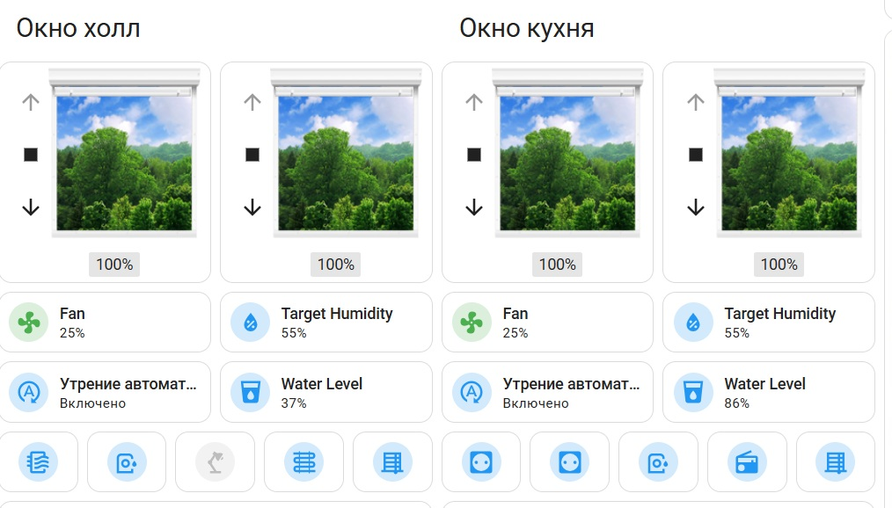
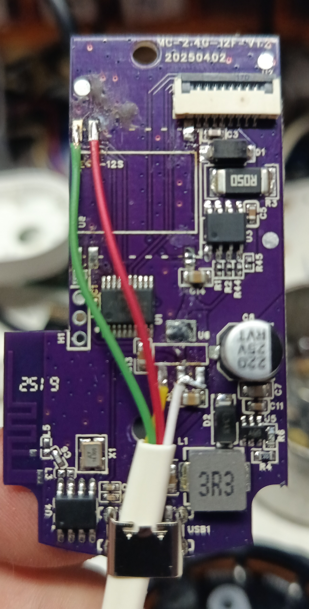
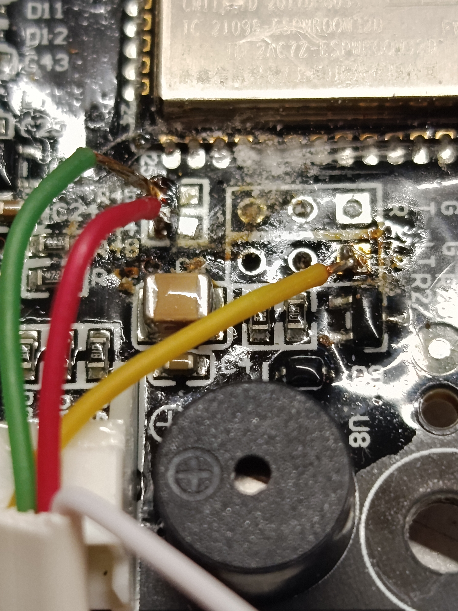

▪ [Базовая конфигурация + реле включения USB](./holl-ekf1.yaml)  

# 🪟 Умный контроллер окна (RCE-1)

> Полная автоматизация оконных, климатических и осветительных систем в помещении на базе ESP32-S3

**Платформа:** ESPHome / Home Assistant

---

## 🧩 Основные возможности

Проект объединяет управление несколькими типами устройств в одном контроллере на базе **EKF Wi-Fi PRO Connect RCE-1-WF**:

| Устройство | Тип | Протокол |
|------------|-----|----------|
| 🪟 Жалюзи (2 зоны) | Моторы Tuya MB60L | UART (Tuya) |
| 💨 Увлажнитель воздуха | Smartmi Evaporative Humidifier 2 | MIoT (UART) |
| 💡 Освещение аквариума | Реле 3 | GPIO |
| 🧽 Фильтр аквариума | Реле 4 | GPIO |
| 🔥 Обогреватель | Реле 1 | GPIO |
| 💧 Увлажнитель (розетка) | Реле 2 | GPIO |
| 🎛️ Индикация статуса | Светодиод WS2812 | RMT |

---

## 🧠 Аппаратная платформа

- **Микроконтроллер:** ESP32-S3-Zero Mini (ESP32-S3)
- **Цифровые изоляторы:** eletechsup
- **Контроллер базируется на:** EKF Wi-Fi PRO Connect RCE-1-WF

### 📍 Распиновка (GPIO)

| Назначение | GPIO |
|------------|------|
| Реле 1 (Обогреватель) | 6 |
| Реле 2 (Увлажнитель) | 5 |
| Реле 3 (Свет аквариума) | 2 |
| Реле 4 (Фильтр аквариума) | 1 |
| Реле 5 (Жалюзи) | 7 |
| Светодиод WS2812 | 3 |
| Кнопка управления | 4 |
| I2C SDA | 8 |
| I2C SCL | 9 |
| Tuya MB60L (зона 1) | 12 (RX) / 13 (TX) |
| Tuya MB60L (зона 2) | 10 (RX) / 11 (TX) |
| Увлажнитель MIoT (UART) | 44 (TX) / 43 (RX) |

> ⚠️ **Важно:** Для использования двух моторов Tuya MB60L требуется установка `MULTI_CONF = True` в компоненте Tuya в файле __init__.py.

---

## ⚡ Автоматизация и сценарии

### 1. Освещение и фильтрация аквариума

- 💡 **Свет аквариума (реле 3)** — включается **на закате**, выключается в **22:00**
- 🧽 **Фильтр аквариума (реле 4)** — работает по расписанию: **09:00 – 22:00**
- 🌙 **Яркость дисплея увлажнителя** - автоматически снижается в **22:00**

### 2. Управление жалюзи (два независимых канала)

- Интеграция с моторами **Tuya MB60L** через UART
- Автоматическое открытие:
  - 🌅 **В рабочие дни в 7:00** (если солнце уже над горизонтом)
  - 🌞 **В выходные в 9:00**
  - 🌙 **Закрытие на закате**
- Дополнительные функции:
  - Управление положением (0–100%)
  - Регулировка скорости (низкая/средняя/высокая)
  - Защита от детей
  - Режим наклона ламелей
  - Сохранение "любимой позиции"
  - Закрытие при включении света в комнате

### 3. Увлажнитель воздуха (Smartmi)

**Мониторинг:**
- 🌡️ Температура
- 💧 Относительная влажность
- 📊 Уровень воды (0–100%)
- 🌀 Скорость мотора (об/мин)
- ⚠️ Статус неисправности 

**Управление:**
- Вентилятор (0–3 уровня)
- Целевая влажность (40–70%)
- Режим "Сушка"
- Режим "Очистка"
- Блокировка от детей
- Звуковые уведомления
- Яркость дисплея (тёмный / мерцающий / максимальный)

### 4. Управление одной кнопкой (GPIO 4)

| Действие | Результат |
|----------|-----------|
| 🔘 Короткое нажатие (<0.5 с) | Включение всех 5 реле |
| 🔘 Длинное нажатие (>1 с) | Выключение всех устройств + LED |

---

## 🌐 Веб-интерфейс и интеграции

- 📡 **Локальный веб-сервер** (порт 80) с авторизацией
- 🏠 **Home Assistant API** с шифрованием
- 🔄 **OTA-обновления** прошивки
- 📶 **Мониторинг WiFi** (сигнал в dBm и %)

---

## 📅 Датчики и условия

- ☀️ **Положение солнца** — вычисляется по координатам
- 📆 **Рабочие/выходные дни** — через сенсор Home Assistant
- 🔌 **Статус подключения** к Home Assistant
- 🎛️ **Мастер-выключатель утренней автоматизации**

---

## 📁 Структура проекта

```text
esphome-ekf/
├── RCE-1/
│   ├── holl-window.yaml         # Основной конфиг (ESP32-S3)
│   ├── images/                  # Схемы и фото
│   └── README.md
└── packages/
    ├── wifi.yaml                # WiFi + API + OTA + сигнал
    ├── device_base.yaml         # Базовая конфигурация
    ├── web.yaml                 # Веб-сервер (авторизация)
    ├── time.yaml                # SNTP (UTC-3)
    ├── sun.yaml                 # Положение солнца
    ├── Tuya_MB60L.yaml          # Драйвер жалюзи
    └── humidifier2.yaml         # Драйвер увлажнителя Smartmi
```






