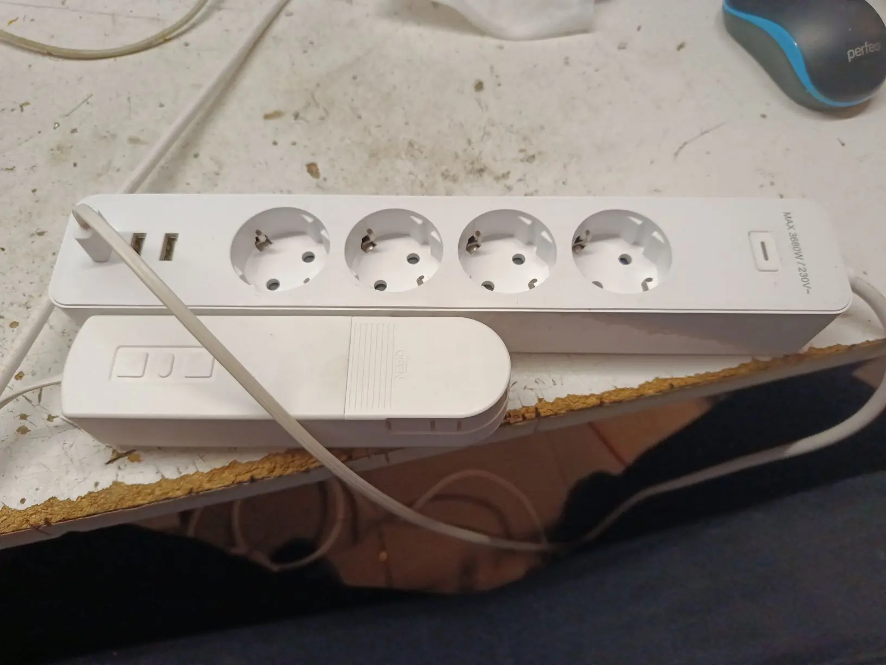
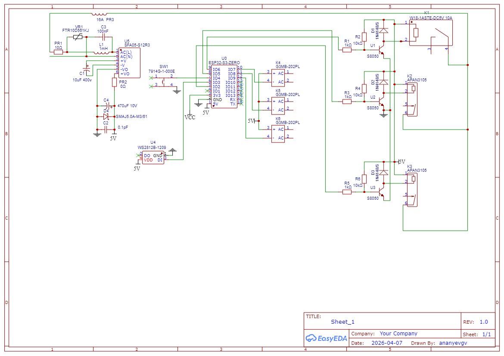

▪ [Базовая конфигурация + реле включения USB](./holl-ekf1.yaml)  

# 🪟 Умный контроллер окна

> Автоматизация оконных и климатических систем в помещении на базе ESP32-S3

📁 **Файлы конфигурации:**  

▪ [Контроллер окна](./holl-window.yaml)

---

## 🧩 Что умеет система?

Проект объединяет управление несколькими типами устройств в одном контроллере:

- 🪟 **Шторы / жалюзи** — два мотора Tuya MB60L в разных зонах
- 💨 **Увлажнитель воздуха** — Smartmi на базе протокола MIoT
- 💡 **Освещение** — аквариум и декоративная подсветка

---

## 🧠 Аппаратная платформа

- **Микроконтроллер:** ESP32-S3-Zero Mini
- **Цифровые изоляторы eletechsup** https://aliexpress.ru/item/1005009571299010.html
  
### Распиновка (ключевые выводы)

| Назначение               | GPIO   |
|--------------------------|--------|
| Реле 1                   | 6      |
| Реле 2                   | 5      |
| Реле 3                   | 2      |
| Реле 4                   | 1      |
| Реле 5                   | 7      |
| Светодиод WS2812         | 3      |
| Кнопка управления        | 4      |
| I2C SDA                  | 8      |
| I2C SCL                  | 9      |
| Tuya MB60L (зона 1)      | 12/13  |
| Tuya MB60L (зона 2)      | 10/11  |
| Увлажнитель MIoT (UART)  | 44/43  |

> ⚙️ **Важно:** Для использования двух моторов Tuya MB60L необходимо установить `MULTI_CONF = True` в компоненте.

---

## ⚡ Основные функции

### 1. Автоматизация освещения и фильтрации

- 🐟 Свет аквариума включается **на закате** (реле 3)
- 🧽 Фильтр аквариума работает по расписанию: **9:00 – 23:00** (реле 4)
- 🔴 Управление RGB-светодиодом для индикации статуса

### 2. Управление жалюзи (два независимых канала)

- Интеграция с моторами **Tuya MB60L** через UART
- Автоматическое открытие:
  - 🌅 В рабочие дни в **7:00** (если солнце уже над горизонтом)
  - 🌞 В выходные в **9:00**
- 🌙 Закрытие на закате
- Дополнительно:
  - Управление положением и скоростью
  - Защита от детей
  - Режим наклона ламелей

### 3. Увлажнитель воздуха

- Модель: **Smartmi Evaporative Humidifier 2**
- Мониторинг:
  - 🌡️ Температура
  - 💧 Влажность
  - 📊 Уровень воды
  - 🌀 Скорость мотора
- Режимы:
  - Сушка
  - Очистка
  - Блокировка от детей

### 4. Сценарии с одной кнопки

| Действие                     | Результат                   |
|------------------------------|-----------------------------|
| 🔘 Короткое нажатие (<0.5с)  | Включение всех реле         |
| 🔘 Длинное нажатие (>1с)     | Выключение всех устройств   |

---

## 🌐 Веб-интерфейс и API

- 📡 Локальный веб-сервер (порт 80) с авторизацией
- 🏠 Home Assistant API с шифрованием
- 🔄 OTA-обновления прошивки
- 📶 Мониторинг WiFi (сигнал в dBm и %)

---

## 📅 Датчики и автоматизация

- ☀️ Вычисление следующего события солнца (восход/закат)
- 📆 Распознавание рабочих/выходных дней через Home Assistant
- 🔌 Статус подключения к HA

---


## 📁 Структура проекта

```text
esphome-ekf/
├── RCE-1/
│ ├── holl-window.yaml # Основной конфиг
│ ├── images/ # Схемы и фото
├── packages/ # Модульные компоненты
│ ├── wifi.yaml # WiFi + API + OTA + сигнал WiFi
│ ├── device_base.yaml # Базовая конфигурация
│ ├── web.yaml # Веб-сервер (с авторизацией)
│ ├── time.yaml # SNTP (UTC-3)
│ ├── sun.yaml # Положение солнца (восход/закат)
│ ├── Tuya_MB60L.yaml # Драйвер жалюзи
│ └── humidifier2.yaml # Драйвер увлажнителя

```

**Пример содержимого `secrets.yaml`:**

```yaml
wifi_ssid: "ваша_сеть"
wifi_password: "ваша пароль"
api_key: "ключ_шифрования"
ota_password: "пароль_ota"
web_username: "имя пользователя"
web_password: "пароль_веб"
latitude: 55.75
longitude: 37.62
```




