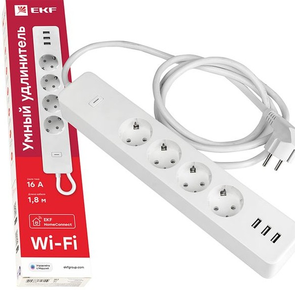
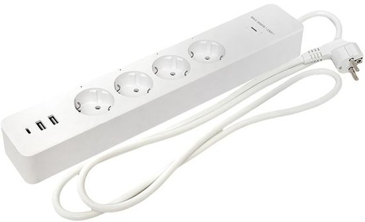

[![License][license-shield]][license]
[![ESPHome release][esphome-release-shield]][esphome-release]

[license-shield]: https://img.shields.io/static/v1?label=License&message=MIT&color=orange&logo=license
[license]: https://opensource.org/licenses/MIT
[esphome-release-shield]: https://img.shields.io/static/v1?label=ESPHome&message=2026.4&color=green&logo=esphome
[esphome-release]: https://GitHub.com/esphome/esphome/releases/

  <h1>🔌 EKF Connect RCE — Wi-Fi удлинитель </h1>
  
<strong>Беспроводные реле для управления нагрузкой</strong>

   

> ⚠️ **Важно**: Перед прошивкой на ESPHome обязательно посмотрите LOG устройства и сделайте **резервную копию (backup)**.

---

## 📌 Модельный ряд

| Модель | Каналов | Описание | Ссылка |
|:------:|:-------:|----------|:------:|
| **RCE-1-WF** | 1 | Одноканальный Wi-Fi удлинитель | [📁 Перейти](./RCE-1) |
| **RCE-2-WF** | 5 | Пятиканальный Wi-Fi удлинитель | [📁 Перейти](./RCE-2) |

Штатное управление через **EKF Connect** или **Tuya** 

---

## ✨ Общие характеристики

| Параметр | Значение |
|----------|----------|
| **Управление** | Wi-Fi (ESPHome) |
| **Напряжение** | 220В (питание от сети) |
| **Прошивка** | ESPHome |

---

## 🖼️ Внешний вид

| RCE-1-WF | RCE-2-WF |
|:---:|:---:|
| Одноканальный Wi-Fi удлинитель | Пятиканальный Wi-Fi удлинитель |

---

## 🔧 Особенности

| № | Особенность |
|:--:|-------------|
| 1 | Компактный корпус для **DIN-рейки** |
| 2 | Управление через **ESPHome** / Home Assistant |
| 3 | Состояние реле сохраняется после перезагрузки |
| 4 | **Полная изоляция** силовой и управляющей части для RCE-2-WF. Для RCE-1-WF реализовано в альтернативной плате. |

---

## 📚 Документация

| Модель | Файлы |
|--------|-------|
| RCE-1-WF | [📁 Перейти в папку RCE-1](./RCE-1) |
| RCE-2-WF | [📁 Перейти в папку RCE-2](./RCE-2) |

---

## ⚠️ Важные примечания

 Для прошивки используйте **USB-UART** адаптер 

---

  
    💡 Разработано для ESPHome | 
    📦 Требуется ESPHome 2026.4+
  

